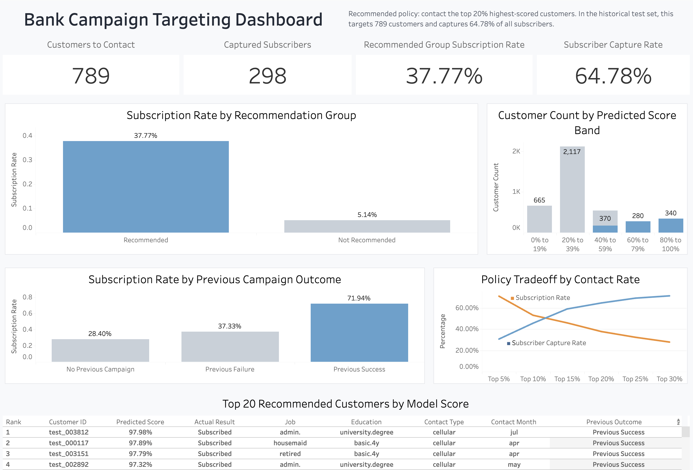

# Bank Campaign Targeting System

An end-to-end machine learning portfolio project for prioritizing bank marketing campaign targets using the UCI Bank Marketing dataset.

The project simulates a campaign targeting workflow where customers are ranked by predicted subscription likelihood, then evaluated using business-oriented top-k targeting metrics instead of relying only on a default classification threshold.

## Key Result

Using the selected **Top 20% targeting policy** on the historical test set:

| Metric | Result |
|---|---:|
| Customers contacted | 789 |
| Subscribers captured | 298 |
| Recommended group subscription rate | 37.77% |
| Subscriber capture rate | 64.78% |
| Lift | 3.24x |

The selected policy means the campaign team would contact only the highest-scored 20% of customers while still capturing nearly two-thirds of all subscribers in the historical test set.

## Business Problem

Banks often run marketing campaigns through customer contact channels such as phone calls. Contacting every customer can be inefficient, especially when only a small share of customers are likely to subscribe.

This project focuses on the question:

> Which customers should be prioritized for a term deposit marketing campaign?

Instead of treating the model only as a binary classifier, this project frames the task as a **customer ranking and campaign prioritization problem**.

## Dataset

This project uses the **UCI Bank Marketing dataset**.

The target variable is `y`, which indicates whether a customer subscribed to a term deposit.

The preferred dataset file is `bank-additional-full.csv`.

## Leakage Handling

The `duration` feature represents call duration and is only known after a customer has already been contacted.

Because this project focuses on pre-call campaign targeting, `duration` is excluded from the modeling dataset to avoid target leakage.

This keeps the model aligned with the intended use case: ranking customers before the campaign contact happens.

## Business Evaluation Design

Because the project is framed as a campaign targeting problem, the final model is evaluated primarily as a ranking system.

Instead of relying only on a fixed 0.5 probability threshold, customers are ranked by predicted probability and evaluated at different contact rates:

- Top 5%
- Top 10%
- Top 15%
- Top 20%
- Top 25%
- Top 30%

The selected targeting policy is **Top 20%**, because it provides a practical balance between campaign reach and subscriber capture:

- Contacts 789 customers in the historical test set
- Captures 298 subscribers
- Captures 64.78% of all subscribers
- Achieves a 37.77% subscription rate within the recommended group
- Produces 3.24x lift compared with the baseline subscription rate

## Tableau Dashboard

The Tableau dashboard translates model outputs into a stakeholder-facing campaign targeting view.

It summarizes the selected Top 20% targeting policy, compares recommended and non-recommended customers, shows predicted score distribution patterns, highlights previous campaign outcome segments, and lists top-priority customers by model score.

Dashboard file: `dashboard/bank_campaign_targeting_dashboard.twbx`

The interactive Tableau dashboard can be accessed through this [Link](https://public.tableau.com/views/BankCampaignTargetingDashboard/BankCampaignDashboard?:language=en-US&publish=yes&:sid=&:redirect=auth&:display_count=n&:origin=viz_share_link).

Dashboard preview:

## Run the Streamlit App

To run the Streamlit demo locally from GitHub:

    git clone https://github.com/Rlvtick/bank-campaign-targeting-system.git
    cd bank-campaign-targeting-system
    python -m venv .venv
    source .venv/bin/activate
    pip install -r requirements.txt
    streamlit run app/streamlit_app.py

The app supports:

- Single-customer scoring
- Batch CSV scoring
- Top 20% policy-based recommendation output

## Run the FastAPI Endpoint

To run the local FastAPI endpoint from GitHub:

    git clone https://github.com/Rlvtick/bank-campaign-targeting-system.git
    cd bank-campaign-targeting-system
    python -m venv .venv
    source .venv/bin/activate
    pip install -r requirements.txt
    uvicorn api.main:app --reload

After starting the API, open:

    http://127.0.0.1:8000/docs

Available endpoints:

| Method | Endpoint | Purpose |
|---|---|---|
| GET | `/health` | Check API status |
| GET | `/policy` | Return the selected targeting policy |
| POST | `/predict` | Score one customer |

Example request file: `api/sample_request.json`

Example local request:

    curl -X POST "http://127.0.0.1:8000/predict" \
      -H "Content-Type: application/json" \
      -d @api/sample_request.json

## Tools and Technologies

| Area | Tools |
|---|---|
| Data processing | Python, pandas, NumPy |
| Modeling | scikit-learn, XGBoost |
| Evaluation | scikit-learn, custom top-k simulation |
| Database | SQLite |
| Application | Streamlit |
| API | FastAPI |
| Dashboard | Tableau |
| Version control | Git, GitHub |

## Limitations

This project is a public-data portfolio simulation, not a production banking system.

Key limitations:

- The dataset is public and does not represent real customer data from a specific bank.
- The final targeting policy is evaluated on historical test data, not a live campaign.
- Actual subscription labels are used only for evaluation and dashboard analysis.
- The project does not include campaign cost, customer lifetime value, revenue, or profit optimization.
- Predicted probabilities are mainly used for ranking customers, not as perfectly calibrated probabilities.

## References

- UCI Machine Learning Repository: Bank Marketing Dataset
- Moro, S., Cortez, P., & Rita, P. (2014). A data-driven approach to predict the success of bank telemarketing.
